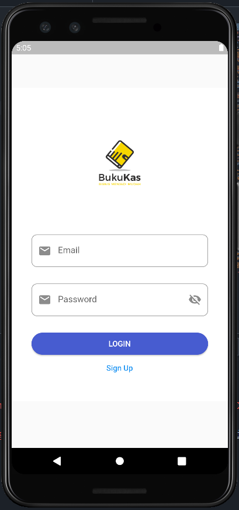
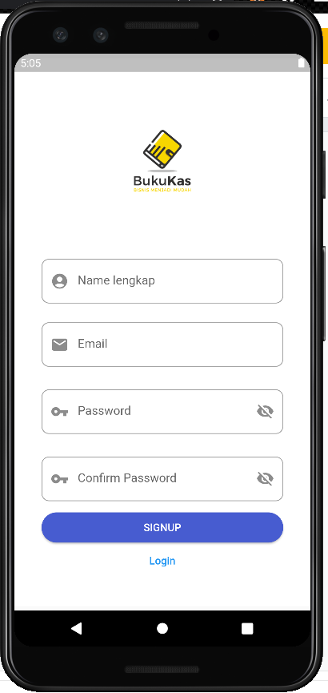
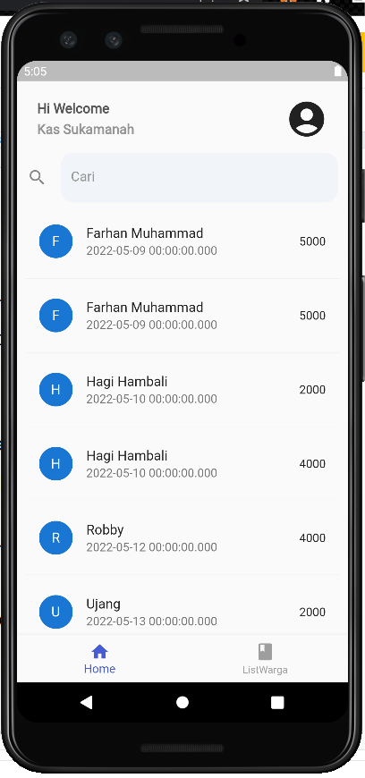
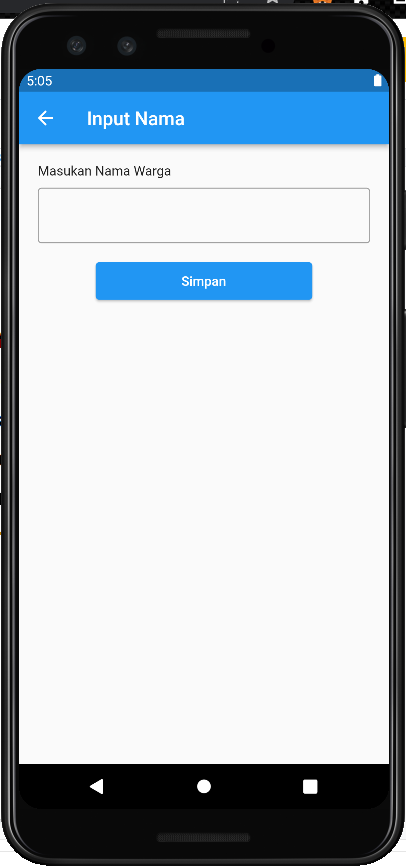

# Mini Project

A mini project that are made using IMDB api and sdk form firebase, so user could do sign up also sign in to save their movie or series list with certain status, for example, the user has a movie in the list with status of watching and more.

## Task

Tugas ini merupakan tugas kita sebagai siswa, untuk membuat sebuah aplikasi berdasarkan syarat-syarat tertentu yang berhubungan dengan dari apa yang sudah kita pelajari. Untuk syarat-syarat tersebut diantara lain.

- Minimum memiliki 5 halaman.
- Menerapkan MVVM architecture.
- Mengakses data menggunakan RESTful API atau SQLite.
- Menggunakan transition.
- Menggunakan Form.

## Minimum Memiliki 5 Halaman
Disini saya membuat sebuah applikasi pencatatan kas rt 

- Screenshot App
Disini saya membuat login yang di auntentication ke firebase jadi nanti kita pas login harus masukan email sama paswword terlebihdahulu 
  
Yang Kedua yaitu fitur signUp sama kayak login yang di auth ke firebase
  
Yang ketiga home dimna di dalam home kita bisa liat daftar warga yang udah membayar kas
  
Fitur list warga dimna si user disini bisa menambahkan warga dan menginputkan uang warga

Input menginputkan warga yang udah bayar kas

Input nama warga baru

